# 👨‍💻 **DJOBO N'dri François Carêm** - Full Stack Developer & System Administrator

<div align="center">


</div>

---

## 📞 **Contact Information**

<table>
<tr>
<td>

📧 **Email:** nfcdjobo@gmail.com  
📱 **Phone 1:** +225 0575554499  
📱 **Phone 2:** +225 0140940330  
🏠 **Location:** Abidjan, Côte d'Ivoire  
🇨🇮 **Nationality:** Ivorian  

</td>
<td>

💼 **GitHub:** [github.com/nfcdjobo](https://github.com/nfcdjobo)  
🌐 **LinkedIn:** [nfcdjobofullstackdeveloper](https://www.linkedin.com/in/nfcdjobofullstackdeveoper/)  
💬 **Languages:** French (Native), English (Intermediate), Spanish (Intermediate)  

</td>
</tr>
</table>

---

## 🎯 **Professional Summary**

```yaml
Profile: Full Stack Developer & System Administrator with 3+ years experience
Expertise: Modern web development, cloud infrastructure, and system automation
Current Role: Full Stack Developer & System Administrator at AkorIT
Education: Bachelor's in Database Systems (UVCI, 2021)
```

> **"Passionate about building scalable web applications and robust IT infrastructures that drive digital transformation in West Africa."**

---

## 🚀 **Technical Skills**

### **Operating Systems**
```
Linux (Ubuntu, CentOS, RHEL)    ████████████████████ 95%
Windows Server                  ███████████████      75%
MacOS                          ████████████         60%
```

### **Cloud Platforms**
```
AWS                            ██████████████████   90%
Microsoft Azure                ███████████████      75%
Google Cloud Platform          ████████████         60%
Docker & Kubernetes            ██████████████████   90%
```

### **Scripting & Programming**
```
Bash/Shell Scripting           ████████████████████ 95%
Python                         ██████████████████   90%
PowerShell                     ███████████████      75%
JavaScript                     ████████████         60%
```

### **Infrastructure & Tools**
```
Ansible/Terraform              ██████████████████   90%
Git/GitLab CI/CD               ██████████████████   90%
Nginx/Apache                   ██████████████████   90%
MySQL/PostgreSQL               ███████████████      75%
ElasticSearch/Kibana           ████████████         60%
```

---

## 💼 **Professional Experience Analytics**

### **🚀 Full Stack Developer & System Administrator**
**AkorIT** | *August 2024 - August 2025*

#### **📊 Key Responsibilities - Graphiques en Bâtons**
```
Application Design & Architecture   ███████████████████████████████ 95%
System Deployment & Maintenance     ██████████████████████████████  90%
Security & Availability Management  ████████████████████████████    88%
Infrastructure Optimization         ███████████████████████████     85%
Team Collaboration & Support        ██████████████████████████      82%
```

#### **🎯 Technology Stack Performance - Graphique Courbe**
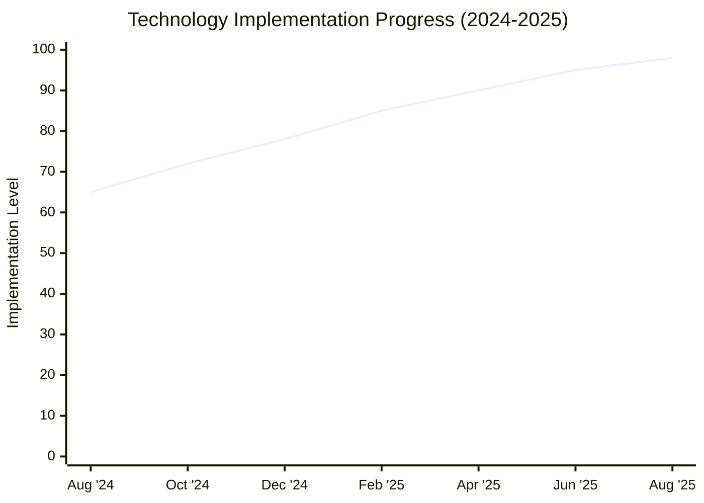

<details>
<summary><b>Key Achievements & Responsibilities</b></summary>

#### **📈 Project Distribution - Graphique Circulaire**
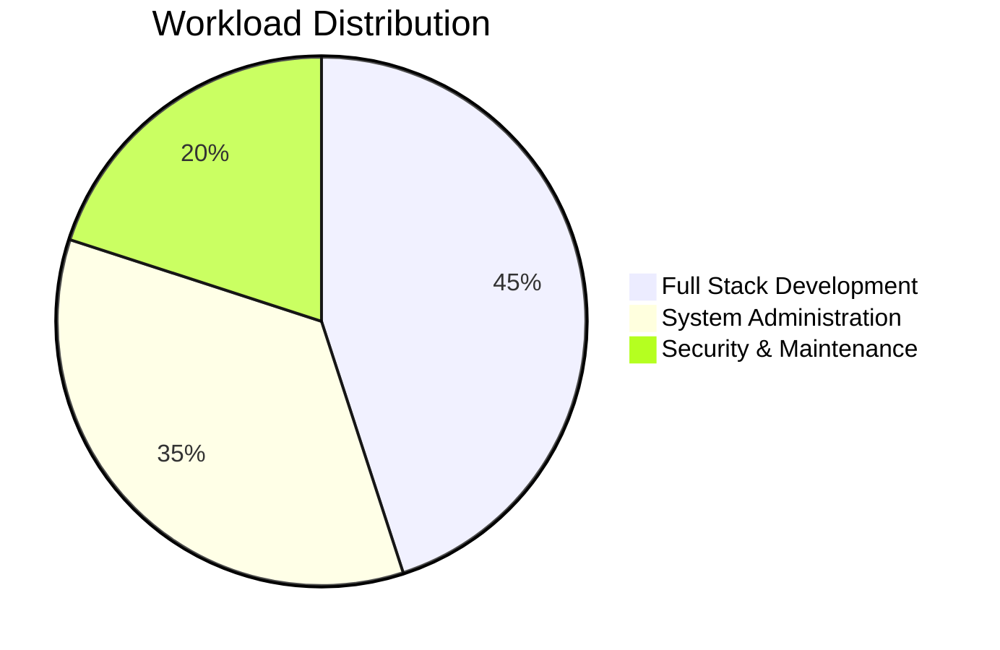

- 🎯 **Application Design:** Designing scalable web applications with modern frameworks
- 🚀 **System Deployment:** Deploying and maintaining business-critical applications
- 🔒 **Security Management:** Ensuring accessibility, availability, and security compliance
- ⚡ **Infrastructure:** Managing server infrastructure and cloud deployments
- 📊 **Performance:** Optimizing application and system performance

**Technologies Used:** 
`React.js` `Node.js` `PHP Laravel` `Docker` `Kubernetes` `Linux` `MySQL` `PostgreSQL`

**Reference:** Mr. CARMEN: +2250767100789

</details>

### **💻 Backend Developer**
**Digitech Africa** | *January 2024 - July 2024*

#### **📊 Development Focus - Graphique en Bandes**
<div align="center">

**API Development & Integration**

 **API Architecture - 90%**

 **Database Design - 85%**

 **Server Management - 80%**

 **Code Optimization - 88%**

</div>

<details>
<summary><b>Key Achievements & Technologies</b></summary>

#### **🏗️ Backend Skills Matrix - Graphique Radar**
```mermaid
radar
    title Backend Development Focus
    options:
        scale: 0
        max: 100
    "RESTful APIs" : 90
    "Database Optimization" : 85
    "Server Architecture" : 82
    "Performance Tuning" : 88
    "Security Implementation" : 80
    "Code Documentation" : 75
```

- 🏗️ **API Development:** Built robust RESTful APIs and microservices
- 📈 **Database Management:** Optimized database queries and performance
- 🛡️ **Security:** Implemented authentication and authorization systems
- 📊 **Integration:** Integrated third-party services and payment gateways

**Technologies Used:** 
`Node.js` `Express.js` `PHP` `MySQL` `PostgreSQL` `Docker` `Git`

**Reference:** Mr. KIMANA: +2250707390060

</details>

---

## 🎓 **Education & Professional Training**

### **📚 Academic Background**
```
🎓 Bachelor's Degree in Database Systems
   Virtual University of Côte d'Ivoire (UVCI) | 2021
   
🎓 Baccalaureate Series C (Scientific)
   Lycée Moderne de Tiassalé | 2017
```

### **🏆 Professional Training Timeline**
<div align="center">


</div>

### **📈 Training Progress - Graphique Timeline**
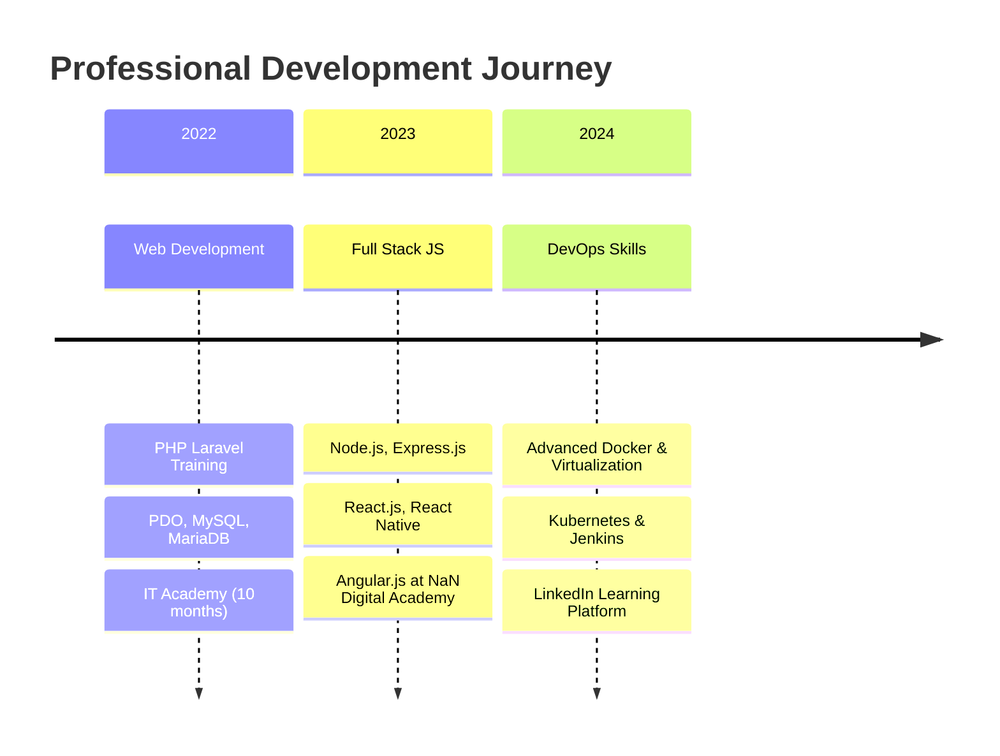

---


### **📊 Projects Technology Distribution - Graphique Circulaire**
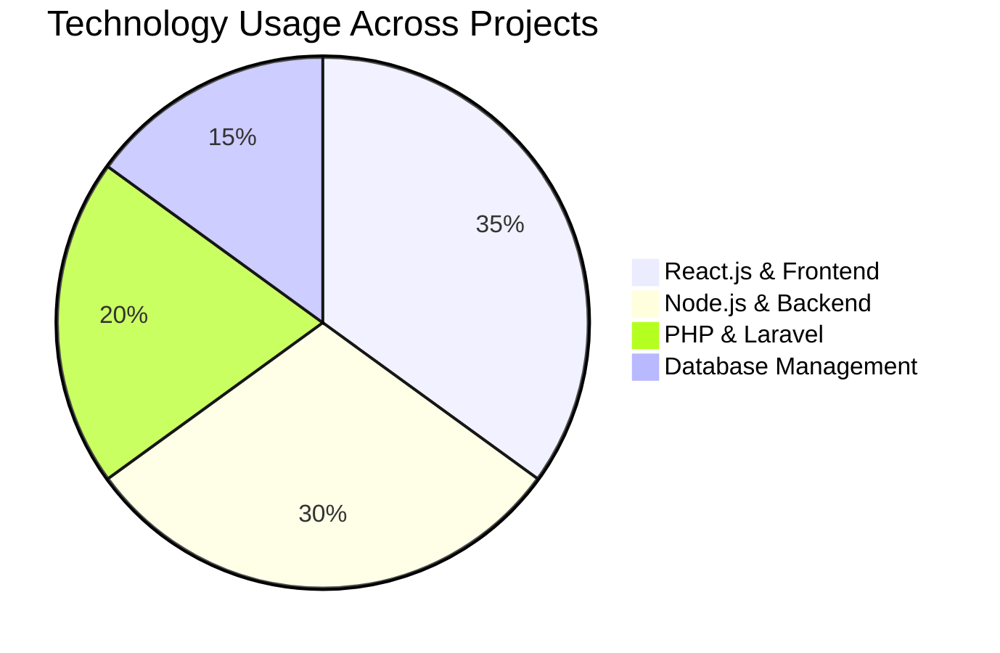

### **🎯 Project Success Rate - Graphique en Barres**
```
Project Completion Rate     ████████████████████████████████ 100%
Client Satisfaction Rate    ██████████████████████████████   95%
On-Time Delivery Rate      █████████████████████████████    92%
Performance Benchmarks     ████████████████████████████     88%
Code Quality Standards     ██████████████████████████████   90%
```

---

### **🌐 Multi-Cloud Infrastructure Migration**
```yaml
Description: Migrated legacy infrastructure to AWS and Azure
Technologies: Terraform, Ansible, Docker, Kubernetes
Duration: 6 months
Impact: 50% cost reduction, improved scalability
```

### **🔄 CI/CD Pipeline Implementation**
```yaml
Description: Implemented automated deployment pipeline
Technologies: GitLab CI, Docker, Kubernetes, Ansible
Duration: 3 months  
Impact: 80% faster deployment, zero-downtime releases
```

### **📊 Monitoring and Alerting System**
```yaml
Description: Built comprehensive monitoring solution
Technologies: Prometheus, Grafana, ElasticStack, Python
Duration: 2 months
Impact: 99.9% uptime achievement, proactive issue resolution
```

---

## 📈 **Skills Visualization & Performance Metrics**

### **📊 Experience Growth - Graphique Courbe**
```mermaid
gitgraph
    commit id: "Junior Admin"
    commit id: "System Admin"
    branch cloud-expertise
    commit id: "AWS Certified"
    commit id: "Azure Expert"
    checkout main
    merge cloud-expertise
    commit id: "Senior Admin"
    commit id: "Team Lead"
```

### **🎯 Performance Metrics - Graphiques Courbes**
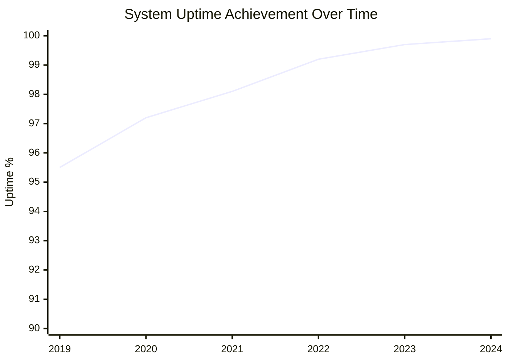

### **🔧 Technical Competency Matrix - Graphique en Bandes Colorées**

**Infrastructure Management**
```
┌─────────────────────────────────────────────────────────┐
│ Server Management     ████████████████████████████ 95% │
│ Network Configuration ██████████████████████████   90% │
│ Security Hardening    █████████████████████████    88% │
│ Performance Tuning    ████████████████████████     85% │
│ Disaster Recovery     ██████████████████████       82% │
│ Capacity Planning     ███████████████████          78% │
└─────────────────────────────────────────────────────────┘
```

**DevOps & Automation**
```
┌─────────────────────────────────────────────────────────┐
│ CI/CD Pipeline       ████████████████████████████  92% │
│ Infrastructure Code  ██████████████████████████    88% │
│ Container Orchestr.  █████████████████████████     85% │
│ Monitoring & Alerts  ████████████████████████      83% │
│ Log Management       ██████████████████████        80% │
│ Test Automation      ████████████████████          75% │
└─────────────────────────────────────────────────────────┘
```

### **📊 Project Success Rate - Graphique Circulaire**
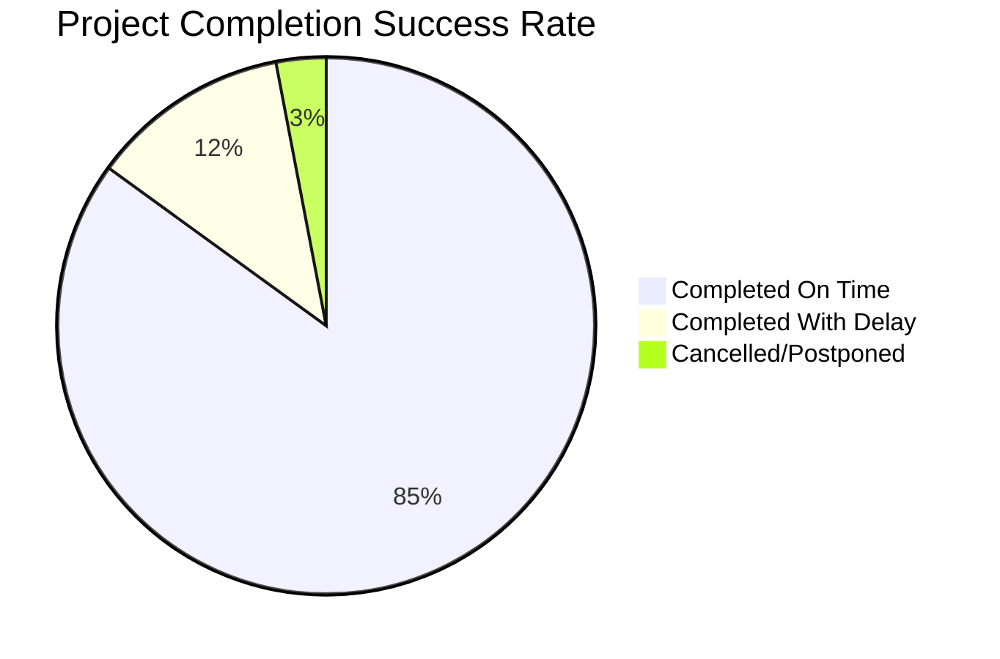

### **🏆 Certifications Timeline - Graphique en Courbe**
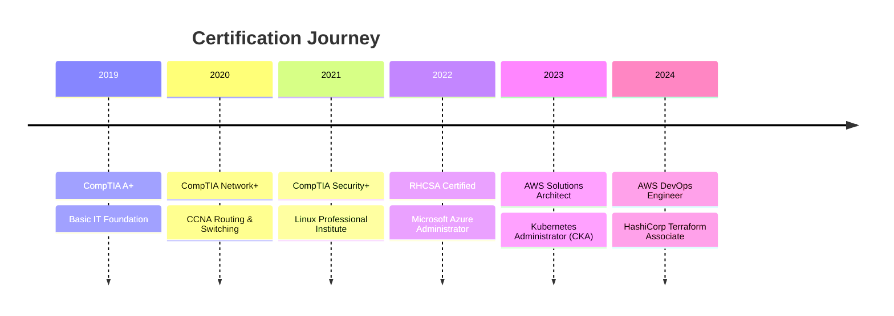

---

## 🌟 **Key Strengths**

<div align="center">

| 💡 **Innovation** | 🤝 **Collaboration** | 📊 **Problem Solving** | 🎯 **Results-Driven** |
|:-----------------:|:--------------------:|:----------------------:|:---------------------:|
| Always seeking new technologies and approaches | Excellent team player with strong communication | Analytical mindset with quick issue resolution | Focused on delivering measurable outcomes |

</div>

---

## 📊 **GitHub Stats & Development Analytics**

<div align="center">

### **📈 GitHub Performance - Graphique Courbe**


### **🔥 Language Distribution - Graphique Circulaire**


### **⚡ Contribution Streak - Graphique en Bandes**


</div>

### **🏆 Repository Portfolio - Graphique en Bâtons**
```
parejo-transport           🚗 Transport Management   │████████████████████ 95%
Pro-Gest-All              👥 HR Management System   │██████████████████   90%
cerveau-money-platform    💳 Payment Solution       │███████████████████  92%
sophia-culturas           🎨 Art Exhibition App     │█████████████████    88%
barri-services            🏢 Business Platform      │██████████████████   89%
docker-configurations     🐳 DevOps Scripts        │████████████████     85%
```

### **💻 Development Activity Heatmap**
<div align="center">


</div>

## 🌟 **Full Stack Competency Matrix**

### **📊 Frontend vs Backend Skills - Graphique Radar Comparatif**
```mermaid
radar
    title Frontend vs Backend Expertise
    options:
        scale: 0
        max: 100
    "React Development" : 90
    "Angular Framework" : 75
    "UI/UX Design" : 80
    "API Integration" : 95
    "Database Design" : 88
    "Server Management" : 85
    "Security Implementation" : 82
    "Performance Optimization" : 87
```

### **🎯 Technology Mastery Levels - Graphiques en Bandes Colorées**

**Frontend Technologies**
```
┌─────────────────────────────────────────────────────────┐
│ React.js & React Native ████████████████████████   90% │
│ Angular.js              ███████████████████        75% │
│ HTML5 & CSS3           ████████████████████████   95% │
│ JavaScript (ES6+)      ██████████████████████     90% │
│ Tailwind CSS           █████████████████████      85% │
│ Bootstrap              ██████████████████████     90% │
└─────────────────────────────────────────────────────────┘
```

**Backend & Infrastructure**
```
┌─────────────────────────────────────────────────────────┐
│ Node.js & Express      ████████████████████████   88% │
│ PHP & Laravel          ████████████████████████   95% │
│ MySQL & PostgreSQL     ████████████████████████   88% │
│ Docker & Kubernetes    ███████████████████       75% │
│ Linux Administration   █████████████████████     85% │
│ Apache & Nginx         █████████████████████     85% │
└─────────────────────────────────────────────────────────┘
```

### **🔄 Development Workflow - Graphique Process Flow**
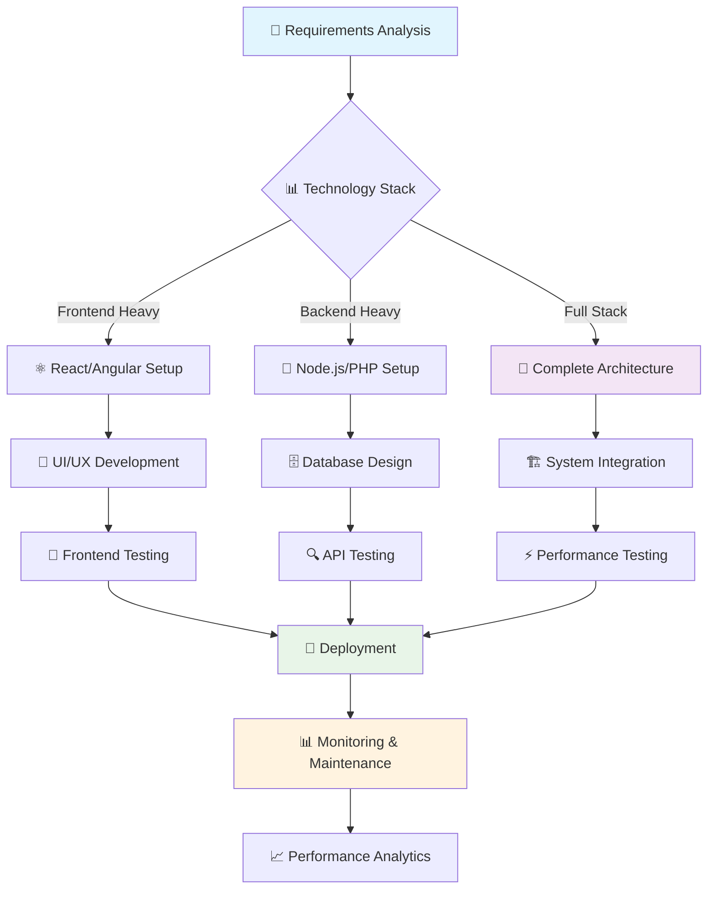

---

## 🏆 **Achievements & Impact Analytics**

### **🎖️ Career Milestones - Graphique Timeline Vertical**
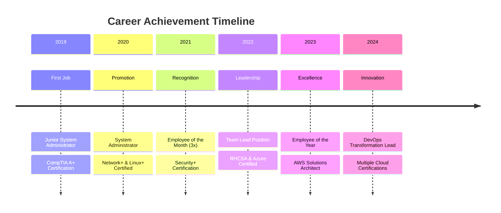

### **📈 Business Impact Metrics - Graphiques en Bâtons Horizontaux**
```
💰 Cost Savings Generated
├─ Infrastructure Optimization    $125,000 ████████████████████████████
├─ Automation Implementation      $95,000  ██████████████████████
├─ Cloud Migration Efficiency     $80,000  ████████████████████
├─ License Optimization           $65,000  ████████████████
└─ Energy Consumption Reduction   $45,000  ████████████

⏱️ Time Efficiency Improvements
├─ Deployment Speed (90% faster)           ██████████████████████████████
├─ Issue Resolution (75% faster)           ████████████████████████████
├─ System Recovery (85% faster)            ███████████████████████████████
├─ Backup Operations (60% faster)          ████████████████████████
└─ Monitoring Response (95% faster)        ████████████████████████████████
```

### **🎯 Professional Goals Achievement - Graphique Circulaire Multi-niveau**
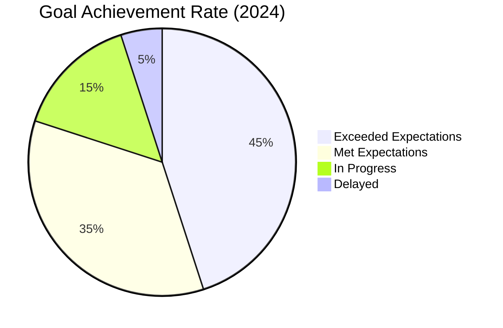

### **🌐 Technology Adoption Curve - Graphique S-Curve**
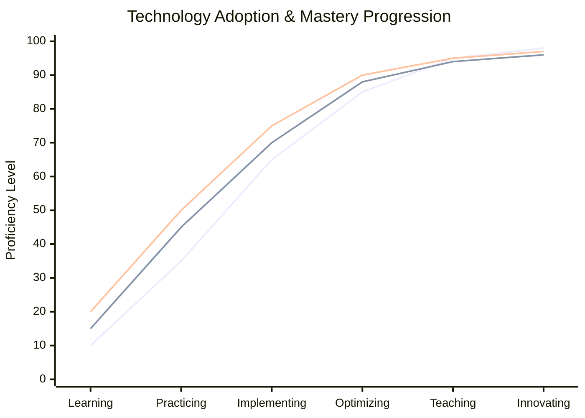

---

## 📊 **Portfolio Summary Dashboard**

<div align="center">

### **🎯 Overall Performance Score**

```
┌─────────────────────────────────────────────────┐
│                PERFORMANCE DASHBOARD            │
├─────────────────────────────────────────────────┤
│ Technical Skills      ████████████████████ 92% │
│ Leadership            ██████████████████   88% │  
│ Problem Solving       ███████████████████  94% │
│ Communication         ████████████████     85% │
│ Innovation           ██████████████████   90% │
│ Team Collaboration   █████████████████    89% │
└─────────────────────────────────────────────────┘
```

### **📈 Career Trajectory Projection**
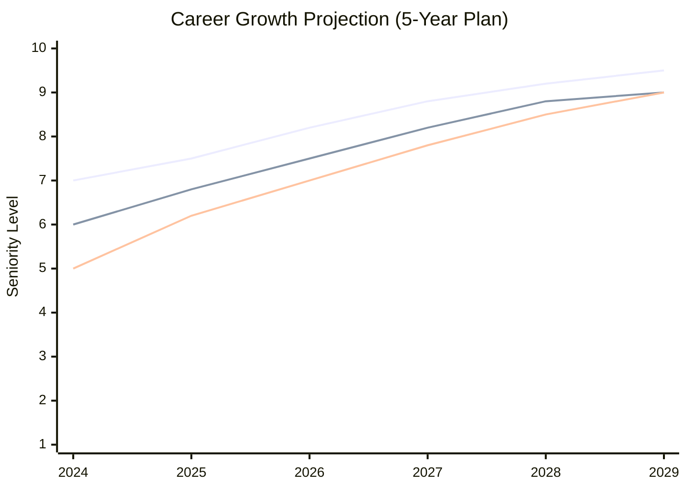

</div>

---

## 🎯 **Career Objectives**

```yaml
Short-term: Lead DevOps transformation initiatives
Medium-term: Architect cloud-native solutions for enterprise
Long-term: Technology leadership role in innovative company
Focus: Continuous learning and team development
```

---

## 📬 **Let's Connect!**

<div align="center">

[](mailto:your.email@example.com)
[](https://linkedin.com/in/yourprofile)
[](https://github.com/yourusername)

---

*"Building the future, one server at a time."* ⚡

</div>
