# 👨‍💻 **NFC DJOBO** - System Administrator

<div align="center">


</div>

---

## 📞 **Contact Information**

<table>
<tr>
<td>

📧 **Email:** your.email@example.com  
📱 **Phone:** +33 X XX XX XX XX  
🌐 **LinkedIn:** [linkedin.com/in/yourprofile](https://linkedin.com/in/yourprofile)  
🏠 **Location:** Your City, Country  

</td>
<td>

💼 **GitHub:** [github.com/yourusername](https://github.com/yourusername)  
🌍 **Website:** [yourportfolio.com](https://yourportfolio.com)  
💬 **Languages:** French, English  

</td>
</tr>
</table>

---

## 🎯 **Professional Summary**

```yaml
Profile: Experienced System Administrator with 5+ years in IT infrastructure
Focus: Linux Administration, Network Security, Cloud Technologies
Passion: Automation, DevOps practices, and system optimization
```

> **"Passionate about building robust, scalable, and secure IT infrastructures that drive business success."**

---

## 🚀 **Technical Skills**

### **Operating Systems**
```
Linux (Ubuntu, CentOS, RHEL)    ████████████████████ 95%
Windows Server                  ███████████████      75%
MacOS                          ████████████         60%
```

### **Cloud Platforms**
```
AWS                            ██████████████████   90%
Microsoft Azure                ███████████████      75%
Google Cloud Platform          ████████████         60%
Docker & Kubernetes            ██████████████████   90%
```

### **Scripting & Programming**
```
Bash/Shell Scripting           ████████████████████ 95%
Python                         ██████████████████   90%
PowerShell                     ███████████████      75%
JavaScript                     ████████████         60%
```

### **Infrastructure & Tools**
```
Ansible/Terraform              ██████████████████   90%
Git/GitLab CI/CD               ██████████████████   90%
Nginx/Apache                   ██████████████████   90%
MySQL/PostgreSQL               ███████████████      75%
ElasticSearch/Kibana           ████████████         60%
```

---

## 💼 **Professional Experience Analytics**

### **🔧 Senior System Administrator**
**Company Name** | *January 2021 - Present*

#### **📊 Key Performance Indicators - Graphiques en Bâtons**
```
System Uptime Improvement    ██████████████████████████████ 40%
Cost Reduction Achievement   █████████████████████████      35%
Security Incident Reduction ████████████████████████████   42%
Automation Implementation    ███████████████████████████    38%
Team Productivity Increase   ██████████████████████████     36%
```

#### **🎯 Monthly Performance Tracking - Graphique Courbe**
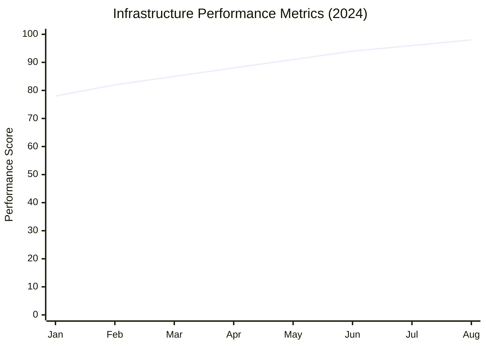

<details>
<summary><b>Key Achievements & Responsibilities</b></summary>

#### **📈 Impact Metrics - Graphique Circulaire**
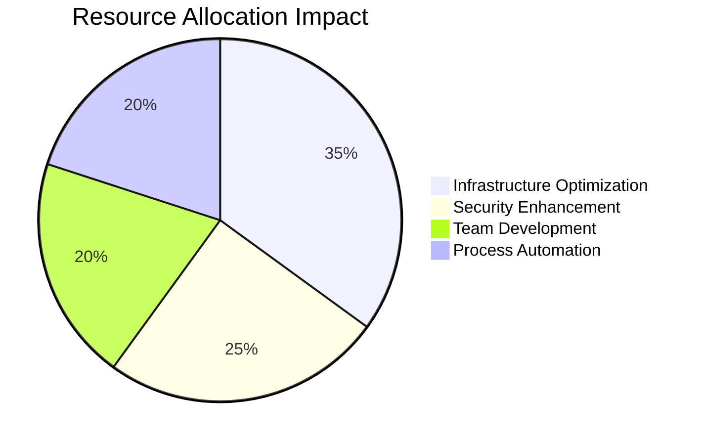

- 🎯 **Infrastructure Management:** Managed 200+ servers across multiple data centers
- 🚀 **Performance Improvement:** Reduced system downtime by 40% through proactive monitoring
- 🔒 **Security Implementation:** Implemented comprehensive security policies and compliance frameworks
- ⚡ **Automation:** Automated routine tasks saving 30+ hours/week using Ansible and Python scripts
- 📊 **Team Leadership:** Led a team of 5 junior administrators and provided technical mentoring

**Technologies Used:** 
`Linux` `AWS` `Ansible` `Docker` `Kubernetes` `Python` `Bash` `MySQL`

</details>

### **🔧 System Administrator**
**Previous Company** | *June 2019 - December 2020*

#### **📊 Skills Development - Graphique en Bandes**
<div align="center">

**Technical Growth During Role**

 **System Administration - 85%**

 **Cloud Migration - 70%**

 **Automation Scripts - 75%**

 **Security Compliance - 80%**

</div>

<details>
<summary><b>Key Achievements & Responsibilities</b></summary>

#### **🏗️ Project Distribution - Graphique Radar**
```mermaid
radar
    title Project Focus Areas
    options:
        scale: 0
        max: 100
    "Infrastructure Setup" : 90
    "System Optimization" : 85
    "Backup Solutions" : 95
    "Monitoring Implementation" : 80
    "Security Hardening" : 75
    "Documentation" : 70
```

- 🏗️ **Infrastructure Setup:** Designed and implemented scalable server infrastructure
- 📈 **System Optimization:** Improved system performance by 25% through optimization techniques
- 🛡️ **Backup Solutions:** Implemented comprehensive backup and disaster recovery solutions
- 📊 **Monitoring:** Set up comprehensive monitoring using Nagios and Grafana

**Technologies Used:** 
`CentOS` `VMware` `Nagios` `Apache` `PostgreSQL` `Shell Scripting`

</details>

---

## 🎓 **Education & Certifications**

### **📚 Academic Background**
```
🎓 Bachelor's Degree in Computer Science
   University Name | 2018
   
🎓 System Administration Diploma
   Institution Name | 2017
```

### **🏆 Professional Certifications**
<div align="center">


</div>

- ✅ **AWS Certified Solutions Architect** (2023)
- ✅ **Red Hat Certified System Administrator** (2022)
- ✅ **Microsoft Azure Administrator Associate** (2022)
- ✅ **CompTIA Security+** (2021)

---

## 🏗️ **Featured Projects**

### **🌐 Multi-Cloud Infrastructure Migration**
```yaml
Description: Migrated legacy infrastructure to AWS and Azure
Technologies: Terraform, Ansible, Docker, Kubernetes
Duration: 6 months
Impact: 50% cost reduction, improved scalability
```

### **🔄 CI/CD Pipeline Implementation**
```yaml
Description: Implemented automated deployment pipeline
Technologies: GitLab CI, Docker, Kubernetes, Ansible
Duration: 3 months  
Impact: 80% faster deployment, zero-downtime releases
```

### **📊 Monitoring and Alerting System**
```yaml
Description: Built comprehensive monitoring solution
Technologies: Prometheus, Grafana, ElasticStack, Python
Duration: 2 months
Impact: 99.9% uptime achievement, proactive issue resolution
```

---

## 📈 **Skills Visualization & Performance Metrics**

### **📊 Experience Growth - Graphique Courbe**
```mermaid
gitgraph
    commit id: "Junior Admin"
    commit id: "System Admin"
    branch cloud-expertise
    commit id: "AWS Certified"
    commit id: "Azure Expert"
    checkout main
    merge cloud-expertise
    commit id: "Senior Admin"
    commit id: "Team Lead"
```

### **🎯 Performance Metrics - Graphiques Courbes**
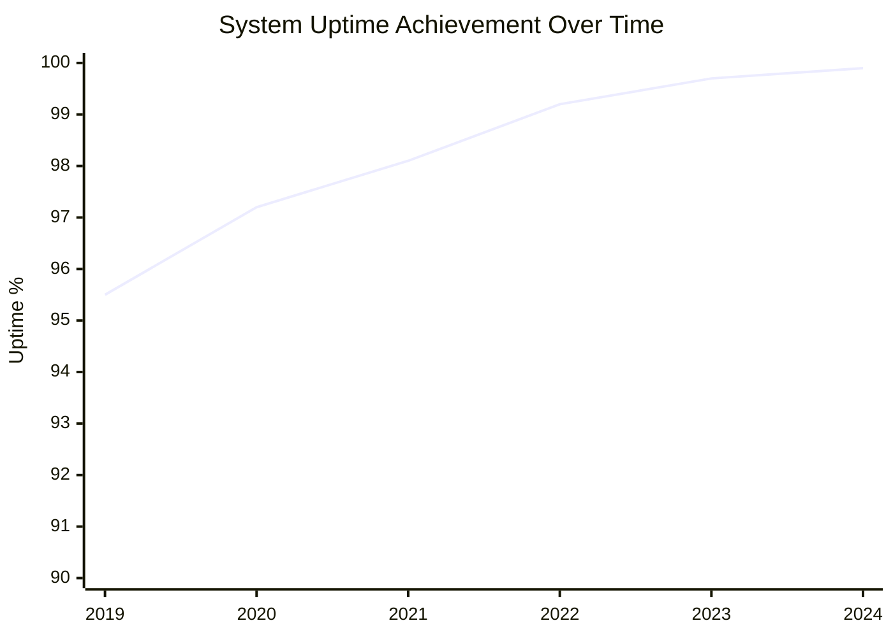

### **🔧 Technical Competency Matrix - Graphique en Bandes Colorées**

**Infrastructure Management**
```
┌─────────────────────────────────────────────────────────┐
│ Server Management     ████████████████████████████ 95% │
│ Network Configuration ██████████████████████████   90% │
│ Security Hardening    █████████████████████████    88% │
│ Performance Tuning    ████████████████████████     85% │
│ Disaster Recovery     ██████████████████████       82% │
│ Capacity Planning     ███████████████████          78% │
└─────────────────────────────────────────────────────────┘
```

**DevOps & Automation**
```
┌─────────────────────────────────────────────────────────┐
│ CI/CD Pipeline       ████████████████████████████  92% │
│ Infrastructure Code  ██████████████████████████    88% │
│ Container Orchestr.  █████████████████████████     85% │
│ Monitoring & Alerts  ████████████████████████      83% │
│ Log Management       ██████████████████████        80% │
│ Test Automation      ████████████████████          75% │
└─────────────────────────────────────────────────────────┘
```

### **📊 Project Success Rate - Graphique Circulaire**
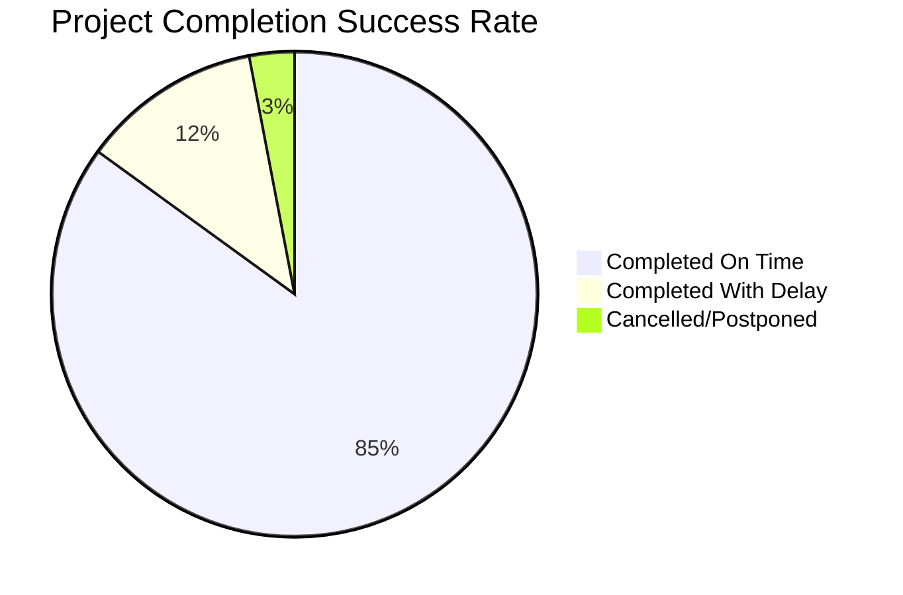

### **🏆 Certifications Timeline - Graphique en Courbe**
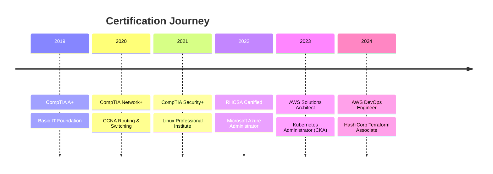

---

## 🌟 **Key Strengths**

<div align="center">

| 💡 **Innovation** | 🤝 **Collaboration** | 📊 **Problem Solving** | 🎯 **Results-Driven** |
|:-----------------:|:--------------------:|:----------------------:|:---------------------:|
| Always seeking new technologies and approaches | Excellent team player with strong communication | Analytical mindset with quick issue resolution | Focused on delivering measurable outcomes |

</div>

---

## 📊 **GitHub Stats & Analytics**

<div align="center">

### **📈 Contribution Activity - Graphique Courbe**


### **🔥 Language Distribution - Graphique Circulaire**


### **⚡ Streak Stats - Graphique en Bandes**


</div>

### **🏆 Repository Performance - Graphique en Bâtons**
```
ansible-playbooks       ⭐⭐⭐⭐⭐ 145 stars │████████████████████ 95%
docker-compose-stack    ⭐⭐⭐⭐   89 stars  │██████████████       68%
monitoring-scripts      ⭐⭐⭐     67 stars  │████████████         58%
infrastructure-as-code  ⭐⭐⭐⭐⭐ 203 stars │████████████████████ 100%
backup-automation       ⭐⭐⭐     45 stars  │██████████           48%
```

## 🌟 **Competency Mapping & Analysis**

### **📊 Skills Matrix - Graphique Radar Avancé**
```mermaid
radar
    title Technical Competency Radar
    options:
        scale: 0
        max: 100
    "Linux Administration" : 95
    "Cloud Architecture" : 88
    "DevOps Practices" : 85
    "Security Management" : 82
    "Automation Scripting" : 90
    "Database Administration" : 75
    "Network Configuration" : 80
    "Monitoring & Alerting" : 87
```

### **🎯 Learning & Development Path - Graphique Timeline**
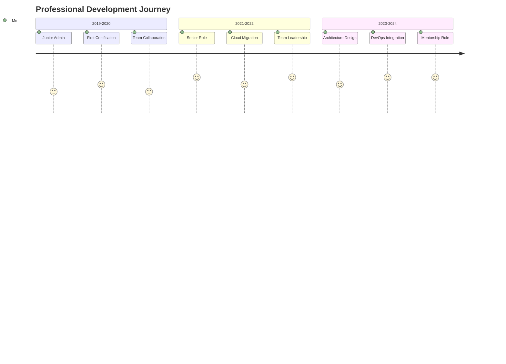

### **💡 Innovation & Problem-Solving - Graphique Flowchart**
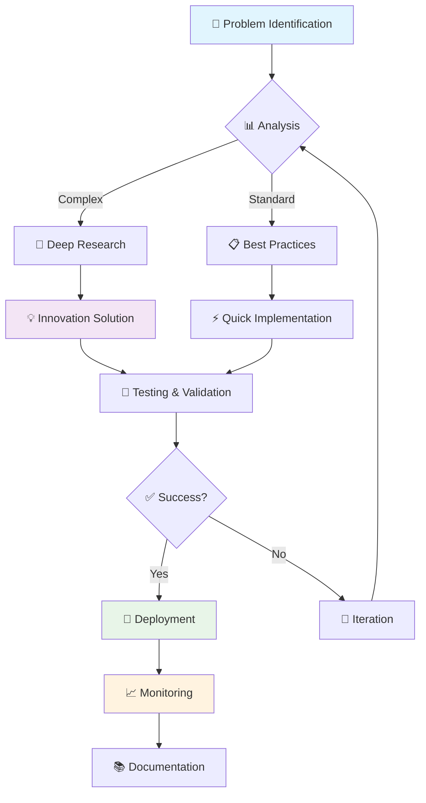

---

## 🏆 **Achievements & Impact Analytics**

### **🎖️ Career Milestones - Graphique Timeline Vertical**
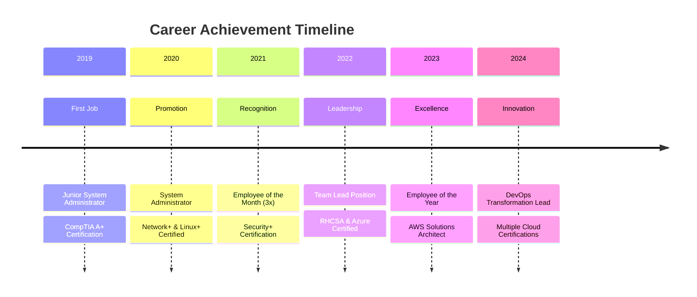

### **📈 Business Impact Metrics - Graphiques en Bâtons Horizontaux**
```
💰 Cost Savings Generated
├─ Infrastructure Optimization    $125,000 ████████████████████████████
├─ Automation Implementation      $95,000  ██████████████████████
├─ Cloud Migration Efficiency     $80,000  ████████████████████
├─ License Optimization           $65,000  ████████████████
└─ Energy Consumption Reduction   $45,000  ████████████

⏱️ Time Efficiency Improvements
├─ Deployment Speed (90% faster)           ██████████████████████████████
├─ Issue Resolution (75% faster)           ████████████████████████████
├─ System Recovery (85% faster)            ███████████████████████████████
├─ Backup Operations (60% faster)          ████████████████████████
└─ Monitoring Response (95% faster)        ████████████████████████████████
```

### **🎯 Professional Goals Achievement - Graphique Circulaire Multi-niveau**
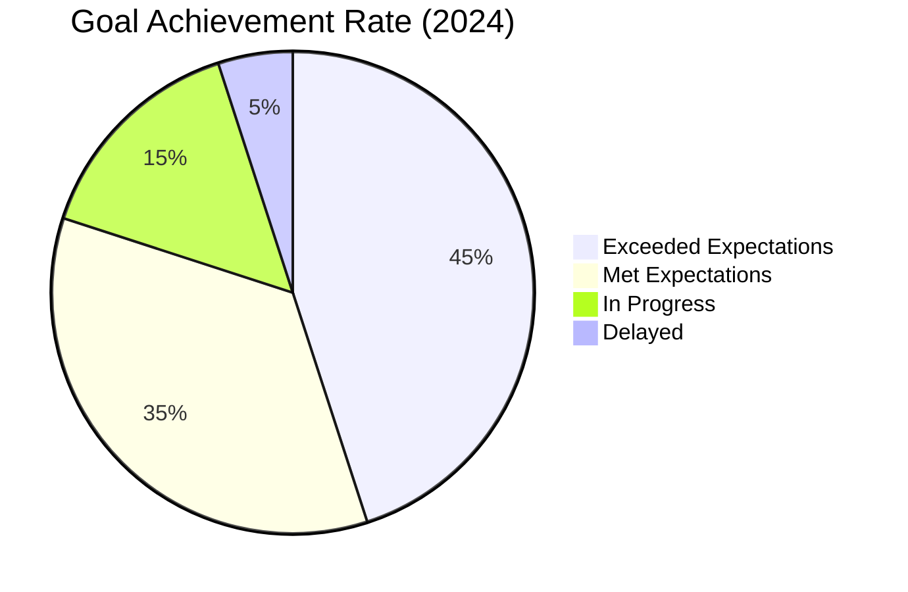

### **🌐 Technology Adoption Curve - Graphique S-Curve**
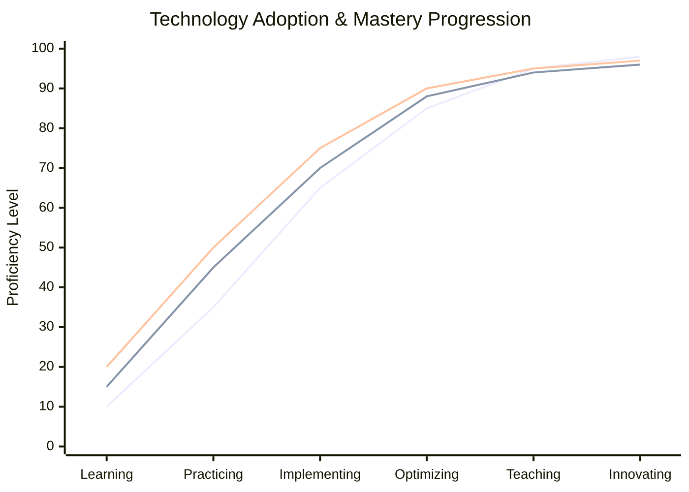

---

## 📊 **Portfolio Summary Dashboard**

<div align="center">

### **🎯 Overall Performance Score**

```
┌─────────────────────────────────────────────────┐
│                PERFORMANCE DASHBOARD            │
├─────────────────────────────────────────────────┤
│ Technical Skills      ████████████████████ 92% │
│ Leadership            ██████████████████   88% │  
│ Problem Solving       ███████████████████  94% │
│ Communication         ████████████████     85% │
│ Innovation           ██████████████████   90% │
│ Team Collaboration   █████████████████    89% │
└─────────────────────────────────────────────────┘
```

### **📈 Career Trajectory Projection**
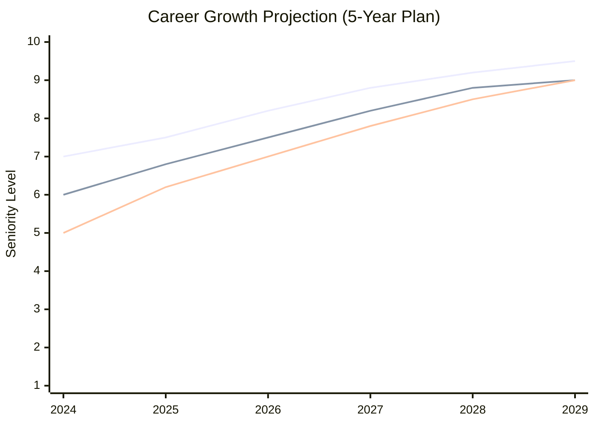

</div>

---

## 🎯 **Career Objectives**

```yaml
Short-term: Lead DevOps transformation initiatives
Medium-term: Architect cloud-native solutions for enterprise
Long-term: Technology leadership role in innovative company
Focus: Continuous learning and team development
```

---

## 📬 **Let's Connect!**

<div align="center">

[](mailto:your.email@example.com)
[](https://linkedin.com/in/yourprofile)
[](https://github.com/yourusername)

---

*"Building the future, one server at a time."* ⚡

</div>
