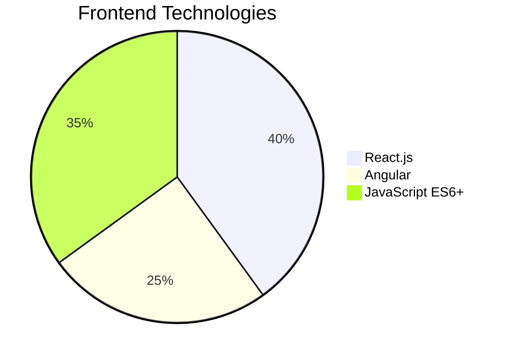
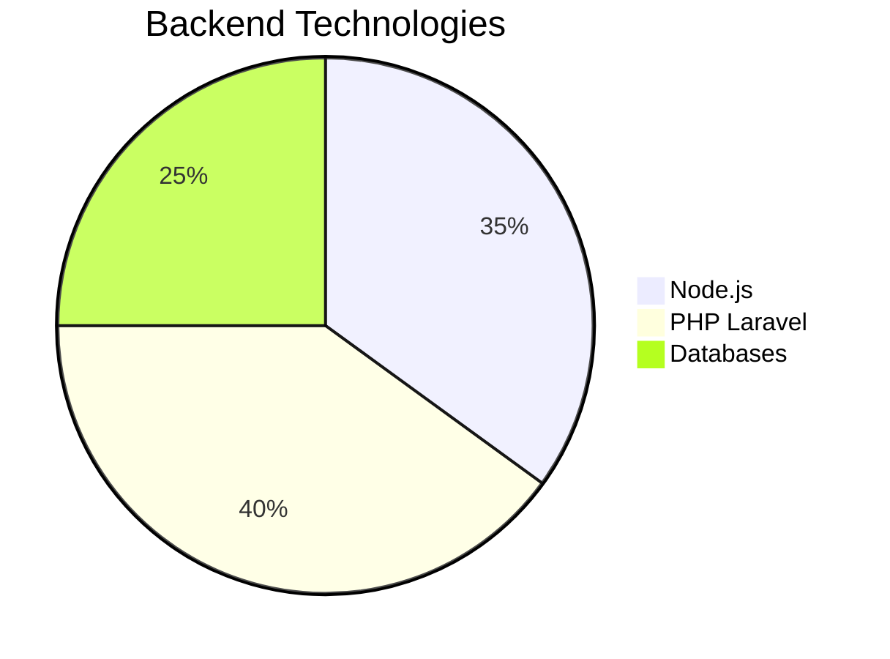

# 💻 **DJOBO N'dri François Carêm**
## Full Stack Developer & System Administrator

<div align="center">


[](https://github.com/nfcdjobo)
[](https://www.linkedin.com/in/nfcdjobofullstackdeveoper/)
[](mailto:nfcdjobo@gmail.com)

</div>

---

## 🚀 **Tech Stack**

### **Frontend**



### **Backend**



### **DevOps & Infrastructure**
```
Docker & Kubernetes     ████████████████████ 85%
Linux Administration    ██████████████████   82%
Jenkins CI/CD          ███████████████      70%
Apache & Nginx         ██████████████████   85%
```


---

## 📊 **GitHub Analytics**

<div align="center">


</div>

---

## 🏗️ **Featured Projects**

| Project | Tech Stack | Status | Link |
|---------|------------|--------|------|
| **💳 Cerveau Money** | Node.js, React, MongoDB | 🟢 Live | [cerveau.onrender.com](https://cerveau.onrender.com/) |
| **🎨 Sophia Culturas** | React, Node.js, PostgreSQL | 🟢 Live | [sophiaculturas.onrender.com](https://sophiaculturas.onrender.com) |
| **🚗 Parejo Viaje** | React, JavaScript, APIs | 🟢 Live | [parejo-transport](https://nfcdjobo.github.io/parejo-transport) |
| **👥 Pro Gest All** | PHP, JavaScript, MySQL | 🟢 Live | [Pro-Gest-All](https://nfcdjobo.github.io/Pro-Gest-All) |
| **🏢 Barri Services** | PHP Laravel, MySQL | 🟢 Live | [barriservices.com](https://barriservices.com) |

### **Project Impact**
```mermaid
radar
    title Project Complexity & Success
    options:
        scale: 0
        max: 100
    "Technical Complexity" : 88
    "User Experience" : 90
    "Performance" : 85
    "Security" : 82
    "Scalability" : 87
    "Code Quality" : 90
```

---

## 💼 **Professional Experience**

**🚀 AkorIT** - *Full Stack Dev & SysAdmin* | `Aug 2024 - Present`
- Application architecture & deployment
- Infrastructure security & optimization
- **Stack:** React, Node.js, Docker, Kubernetes, Linux

**💻 Digitech Africa** - *Backend Developer* | `Jan - Jul 2024`
- RESTful API development
- Database optimization
- **Stack:** Node.js, PHP, MySQL, PostgreSQL

---

## 🎓 **Education & Training**

```yaml
2021: Bachelor's in Database Systems (UVCI)
2023: Full Stack JavaScript (NaN Digital Academy)
2024: Advanced Docker & Kubernetes (LinkedIn Learning)
2022: PHP Laravel Development (IT Academy)
```

---

## 🌍 **Languages**

 **Français** - Native  
 **English** - Intermediate  
 **Español** - Intermediate  

---

## 📞 **Contact**

<div align="center">

📧 **nfcdjobo@gmail.com**  
📱 **+225 0575554499** | **+225 0140940330**  
🏠 **Abidjan, Côte d'Ivoire** 🇨🇮

**Available for senior Full Stack & DevOps opportunities**

</div>
