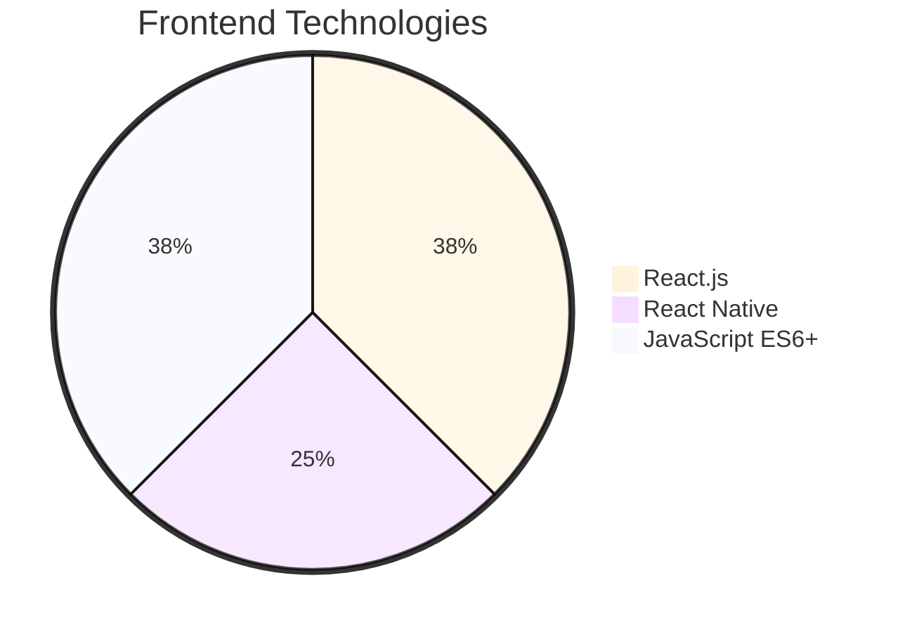
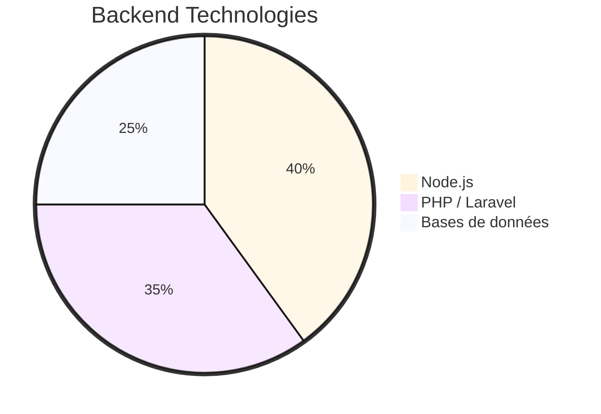

# 👋 Salut, je suis DJOBO N'dri François Carêm

## 💻 Full Stack Developer & System Administrator — Abidjan, Côte d'Ivoire

<div align="center">


[](https://github.com/nfcdjobo)
[](https://www.linkedin.com/in/nfcdjobofullstackdeveoper/)
[](mailto:nfcdjobo@gmail.com)

</div>

---

## 🧑‍💻 À propos de moi

Développeur Full Stack basé à Abidjan, je conçois et maintiens des plateformes SaaS métier pour le marché ivoirien et ouest-africain : gestion de caisse/stock, paie & RH, restauration, et géolocalisation de flottes. Je travaille aussi bien côté serveur (Laravel, Node.js) que côté client (React, React Native), avec une attention particulière portée à l'architecture multi-tenant, la robustesse des migrations de bases de données et le déploiement en environnement contraint (VPS, cPanel).

- 🔭 En ce moment, je travaille sur une plateforme de **suivi de flotte GPS/RFID/IoT** (Node.js/Express/TypeScript/Sequelize) et sur des applications **React Native** (paiement Paystack, licences par appareil).
- 🌱 J'approfondis actuellement Docker/Kubernetes et l'optimisation PostgreSQL (index composites, fonctions fenêtrées).
- 🤝 Ouvert aux collaborations sur des projets Laravel/PostgreSQL et Node.js/TypeScript.
- ⚡ Fun fact : je code aussi bien des systèmes de paie que des animations sur canvas !

---

## 🚀 Stack Technique

### Frontend & Backend — répartition

<div align="center">
<table>
<tr>
<td width="50%" align="center">


```mermaid
%%{init: {'pie': {'textPosition': 0.6}, 'themeVariables': {'pieOuterStrokeWidth': '4px', 'pieSectionTextSize': '16px', 'pieOuterStrokeColor': '#333333'}, 'theme': 'base'}}%%
pie title Frontend Technologies
    "React.js" : 37.5
    "React Native" : 25
    "JavaScript ES6+" : 37.5
```

</td>
<td width="50%" align="center">


```mermaid
%%{init: {'pie': {'textPosition': 0.6}, 'themeVariables': {'pieOuterStrokeWidth': '4px', 'pieSectionTextSize': '16px', 'pieOuterStrokeColor': '#333333'}, 'theme': 'base'}}%%
pie title Backend Technologies
    "Node.js" : 40
    "PHP / Laravel" : 35
    "Bases de données" : 25
```

</td>
</tr>
</table>
</div>

### Frontend


### Backend


### DevOps & Infrastructure
```
Docker & Kubernetes     █████████████████░░░  85%
Linux Administration    ████████████████░░░░  82%
Jenkins CI/CD           ██████████████░░░░░░  70%
Apache & Nginx / Traefik████████████████░░░░  85%
```


---

## 📊 Statistiques GitHub

<div align="center">


</div>

---

## 🏗️ Projets phares

| Projet | Stack | Statut | Lien |
|---|---|---|---|
| 💳 **Cerveau Money** | Node.js, React, MongoDB | 🟢 En ligne | [cerveau.onrender.com](https://cerveau.onrender.com/) |
| 🎨 **Sophia Culturas** | React, Node.js, PostgreSQL | 🟢 En ligne | [sophiaculturas.onrender.com](https://sophiaculturas.onrender.com) |
| 🚗 **Parejo Viaje** | React, JavaScript, APIs, MySQL | 🟢 En ligne | [parejo-transport](https://nfcdjobo.github.io/parejo-transport) |
| 👥 **Pro Gest All** | HTML5, CSS3, JavaScript, LocalStorage | 🟢 En ligne | [Pro-Gest-All](https://nfcdjobo.github.io/Pro-Gest-All) |
| 🏢 **Barri Services** | PHP Laravel, MySQL | 🟢 En ligne | [barriservices.com](https://barriservices.com) |
| 🏢 **Bolou Business Center** | PHP Laravel, MySQL | 🟢 En ligne | [bbcenter.africa](https://www.bbcenter.africa) |

---

## 🛠️ Domaines d'expertise professionnelle

- **SaaS multi-tenant** : architecture `compagnie_id`, clés primaires UUID/ULID, soft deletes, permissions granulaires (RBAC)
- **Paie & RH** : calculs fiscaux ivoiriens (ITS), historique immuable des paramètres, workflows d'approbation
- **Point de vente & stock** : gestion de caisse, traçabilité, notifications push
- **Géolocalisation IoT** : intégration GPS/RFID, API temps réel, tunnels SSH sécurisés
- **DevOps** : Docker/Traefik, hébergement cPanel, CI/CD, gestion DNS et certificats SSL

---

## 🌍 Langues

 **Français** — Natif
 **English** — Intermédiaire
 **Español** — Intermédiaire

---

<div align="center">

💬 **N'hésitez pas à me contacter pour toute collaboration ou opportunité !**

</div>
